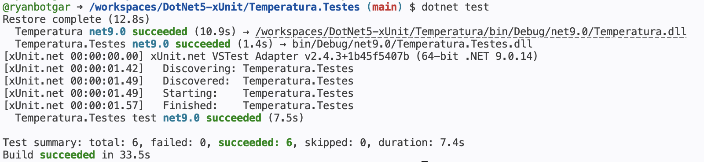
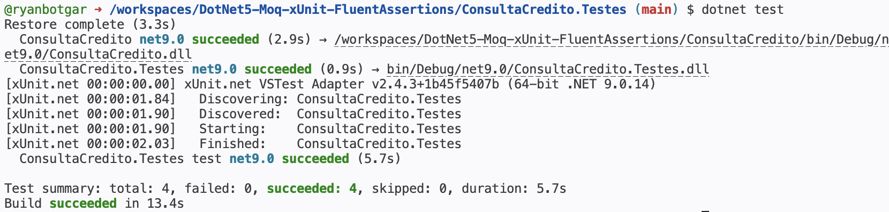
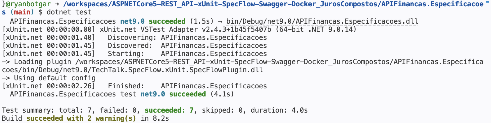

# Aplicando Testes

Repositório de documentação da ponderada da ES09 sobre os três tipos de testes apresentados no artigo: testes unitários, testes com mocks e testes BDD (Behavior-Driven Development). Para cada tipo, foi feito o fork de um repositório de referência, executado no GitHub Codespaces e documentado abaixo com explicação, cenários de exemplo e evidência de execução.

## Sobre o ambiente

Os repositórios originais foram escritos para .NET 5, que está fora de suporte e não vem mais instalado por padrão no Codespaces. Em todos os forks foi necessário atualizar a propriedade `<TargetFramework>` de `net5.0` para `net9.0` nos arquivos `.csproj` de cada projeto da solução para que o `dotnet test` conseguisse executar.

---

## 1. Teste Unitário (xUnit)

**Fork:** https://github.com/ryanbotgar/DotNet5-xUnit

### O que é

Um teste unitário verifica de forma isolada o comportamento de uma unidade pequena de código, geralmente uma função ou método. O objetivo é garantir que, dada uma entrada conhecida, a saída produzida corresponda exatamente à esperada. Não envolve banco de dados, rede ou dependências externas — só a lógica daquela unidade.

Neste fork, o método testado é `ConversorTemperatura.FahrenheitParaCelsius`, que recebe uma temperatura em Fahrenheit e devolve o equivalente em Celsius arredondado para duas casas decimais. O teste usa o atributo `[Theory]` do xUnit com várias entradas via `[InlineData]`, o que permite validar múltiplos pares entrada/saída com um único método de teste.

### Cenários de exemplo

**Cenário 1 — ponto de congelamento da água**
- Entrada: 32 °F
- Saída esperada: 0 °C
- Verifica o caso de fronteira clássico da conversão.

**Cenário 2 — valor com casas decimais**
- Entrada: 90.5 °F
- Saída esperada: 32.5 °C
- Garante que o arredondamento para duas casas decimais funciona corretamente em valores não inteiros.

### Execução



Resultado: 6 cenários executados, 6 aprovados.

---

## 2. Teste com Mock (Moq + xUnit + FluentAssertions)

**Fork:** https://github.com/ryanbotgar/DotNet5-Moq-xUnit-FluentAssertions

### O que é

Quando o código a ser testado depende de outra classe ou serviço (banco de dados, API externa, sistema de mensageria), testar diretamente essa dependência traz problemas: lentidão, instabilidade e falta de controle sobre os retornos. A solução é o **mock**: um objeto falso, controlado pelo teste, que substitui a dependência real e devolve exatamente o que o cenário precisa.

Neste fork, a classe `AnaliseCredito` depende de uma interface `IServicoConsultaCredito` que normalmente chamaria um serviço externo de consulta de pendências por CPF. Nos testes, essa interface é substituída por um `Mock<IServicoConsultaCredito>` configurado para devolver respostas diferentes conforme o CPF passado. O `FluentAssertions` é usado para escrever as asserções de forma mais legível (`status.Should().Be(...)`).

### Cenários de exemplo

**Cenário 1 — CPF inadimplente**
- O mock é configurado para devolver uma lista com uma pendência quando o CPF `82226651209` é consultado.
- O teste verifica se o status retornado é `StatusConsultaCredito.Inadimplente`.

**Cenário 2 — erro de comunicação**
- O mock é configurado para lançar uma exceção ao consultar o CPF `76217486300`, simulando uma falha no serviço externo.
- O teste verifica se a classe captura a exceção e retorna `StatusConsultaCredito.ErroComunicacao`, validando o tratamento de erro sem precisar de um serviço real fora do ar.

### Execução



Resultado: 4 cenários executados, 4 aprovados.

---

## 3. Teste BDD (SpecFlow + xUnit)

**Fork:** https://github.com/ryanbotgar/ASPNETCore5-REST_API-xUnit-SpecFlow-Swagger-Docker_JurosCompostos

### O que é

BDD (Behavior-Driven Development) é uma abordagem em que os testes são escritos em linguagem natural, no formato `Dado / Quando / Então`, descrevendo o comportamento esperado do sistema do ponto de vista de quem usa. Isso permite que pessoas não técnicas (analistas de negócio, product owners) leiam, entendam e até escrevam cenários junto com o time de desenvolvimento. O SpecFlow é a ferramenta que traduz esses cenários, escritos em arquivos `.feature` na sintaxe Gherkin, para métodos de teste executáveis em C#.

Neste fork, a regra de negócio testada é o cálculo de juros compostos exposto pela API. Cada cenário descreve um empréstimo com valor, prazo em meses e taxa, e verifica se o valor final calculado bate com o esperado.

### Cenários de exemplo

**Cenário 1 — empréstimo de R$ 10.000 por 12 meses a 2% ao mês**
```gherkin
Dado que o valor o valor do empréstimo é de R$ 10.000,00
E que este empréstimo será por 12 meses
E que a taxa de juros é de 2,00% ao mês
Quando eu solicitar o cálculo do valor total a ser pago ao final do período
Então o resultado será 12.682,42
```

**Cenário 2 — empréstimo de R$ 25.000 por 48 meses a 6% ao mês**
```gherkin
Dado que o valor o valor do empréstimo é de R$ 25.000,00
E que este empréstimo será por 48 meses
E que a taxa de juros é de 6,00% ao mês
Quando eu solicitar o cálculo do valor total a ser pago ao final do período
Então o resultado será 409.846,79
```

### Correção de bug encontrada durante a execução

Na primeira execução dos testes, 5 dos 7 cenários falharam com mensagens semelhantes a:

```
Expected: 12682,42
Actual:   12682,417945625455
```

O problema estava no método `CalcularValorComJurosCompostos` (arquivo `APIFinancas/CalculoFinanceiro.cs`), que retornava o resultado de `valorEmprestimo * Math.Pow(1 + (percTaxa / 100), numMeses)` sem arredondar para duas casas decimais. O próprio autor do repositório havia deixado a linha correta comentada e a errada ativa, sinalizada pelo comentário `// Simulação de falha`. A correção foi inverter os comentários, passando a usar a versão com `Math.Round(..., 2)`. Após o ajuste, todos os 7 cenários passaram.

### Execução



Resultado: 7 cenários executados, 7 aprovados.
